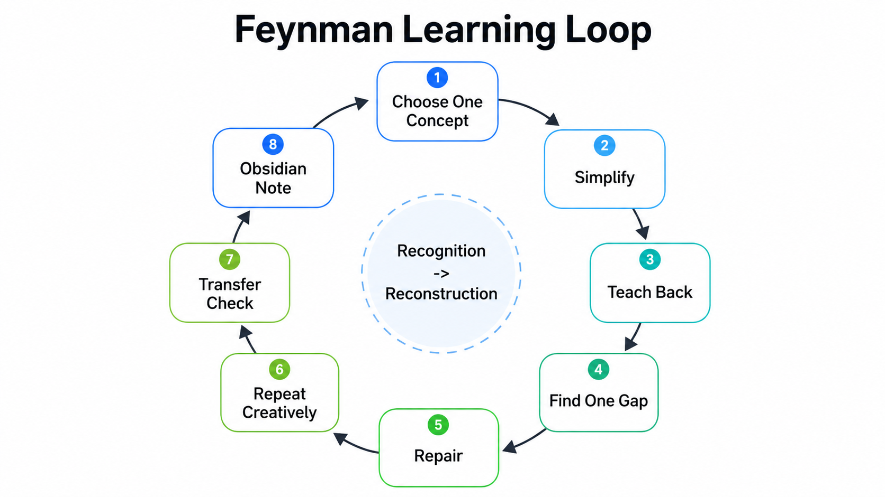
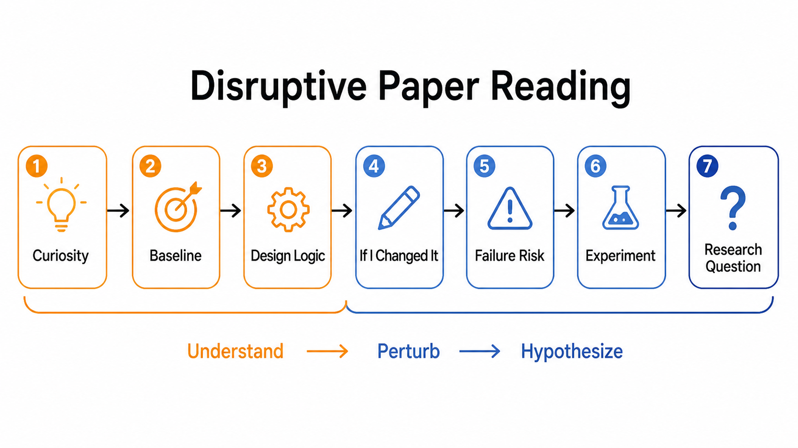

# Feynman Learning Skills

[](https://github.com/WangPu1999/feynman-learning-skills)
[](LICENSE)
[](skills/feynman-learning)

[简体中文](README.zh-CN.md) | [English](README.en.md)

A curiosity-first learning skill for master's students: concepts, research
papers, technical ideas, IELTS/TOEFL English, and job/internship interview
preparation.

It is designed to cover four common graduate-student needs: learning and exams,
English ability, research development, and career preparation.

It starts from questions many learners recognize:

- Why can you score well on an exam, then forget almost everything one week
  later?
- Why can you spend years learning a foreign language from primary school
  through university, yet still feel the result is weak?

Real learning is not "I recognize this answer." It is "I can rebuild it, explain
it, stress its boundary, and use it in a new situation." This skill turns
learning from recognition into reconstruction: simplify, teach back, repair one
gap, then connect the idea to your field, boundaries, research questions, or
interview stories.

## Flow

<table>
  <tr>
    <td width="50%"></td>
    <td width="50%"></td>
  </tr>
</table>

## Install

```bash
git clone https://github.com/WangPu1999/feynman-learning-skills.git
cd feynman-learning-skills
./scripts/install.sh all
```

Fetch external reference repositories:

```bash
git submodule update --init --recursive
```

Preview install targets without changing files:

```bash
./scripts/install.sh --dry-run all
```

## Modes

| Mode | Purpose |
|---|---|
| Feynman loop | General concept learning through teach-back and one-gap repair. |
| Boundary | Math/technical learning through limits, assumptions, parent forms, and special cases. |
| Disruptive | Paper and pipeline learning through baseline, design logic, modification, risk, and experiment. |
| Research growth | Graduate research training: stage, ability target, project loop, experiments, writing, and meetings. |
| IELTS/TOEFL English | Paraphrase, coherence, argument, academic register, and clear expression. |
| Interview prep | Graduate job and internship prep: research stories, projects, fundamentals, role fit, tradeoffs, and follow-ups. |
| Note | Obsidian-ready summary of the useful learning result. |

## Examples

```text
Help me understand Minkowski distance through boundaries and special cases.
```

```text
I want to study C-JEPA: baseline, design choices, what I would change, and what experiment would test it.
```

```text
我刚进实验室，想知道下一阶段该怎么训练科研能力。
```

```text
For IELTS writing, help me paraphrase this idea without changing the meaning.
```

```text
Help me prepare for an internship interview: explain my project, tradeoffs, and likely follow-up questions.
```

## Other Tools

This repository is not limited to Codex or Cursor. For Claude Code, Trae, or
similar agent tools, clone the repository and ask the tool to read
`skills/feynman-learning/SKILL.md`. The `references/` files are intentionally
plain Markdown so other agents can follow the same workflow.

## Structure

```text
.
├── assets/
├── external/
│   └── learning_research/      # Git submodule: pengsida/learning_research
├── scripts/
│   └── install.sh
└── skills/
    └── feynman-learning/
        ├── SKILL.md
        ├── commands/
        └── references/
```

## Prior Art

Inspired by Feynman-technique skills, academic research skill routing patterns,
Chinese learning content on the Feynman mental model, and public research
training notes by [pengsida](https://github.com/pengsida), especially
[pengsida/learning_research](https://github.com/pengsida/learning_research).
This project focuses on curiosity-first understanding for master's students:
learning, research, English ability, interview preparation, and Obsidian notes.

[`pengsida/learning_research`](https://github.com/pengsida/learning_research)
is referenced as an external source of research training ideas. Its content is
included as a Git submodule under `external/learning_research`, pinned to an
upstream commit. The upstream repository does not currently include an explicit
license file, so its content remains an external reference and is not covered by
this repository's MIT license.

## License

MIT
