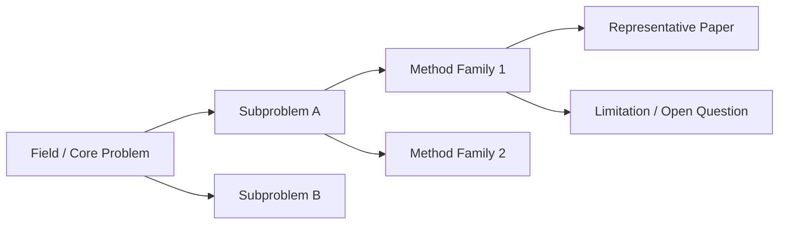

# Research Growth

Use when the learner wants to become better at research, enter a new research
field, plan a research project, prepare advisor meetings, build a long-term
roadmap, or understand what ability a graduate student should train next.

This branch is inspired by public research-training notes such as
`pengsida/learning_research`, but should adapt to the learner's field and avoid
copying fixed routes.

## Stage First

Pick the current stage before giving advice:

| Stage | Main Goal | Good Output |
|---|---|---|
| Foundation | Build breadth and basic tools | field map, concept map, course/homework plan, must-know papers |
| Project shadowing | Learn how a paper/project is made | paper mechanism, code path, experiment table, meeting notes |
| Independent project | Complete a first-author-style loop | problem, baseline, idea, experiments, writing plan |
| Long roadmap | Connect projects into a direction | important question, roadmap, milestones, demo/story |

Do not give mature-roadmap advice to a learner who first needs one concrete
project step.

## Research Ability Map

Train one ability at a time:

- **Find problems**: What is important, under-solved, measurable, and connected
  to a real use case?
- **Generate ideas**: What baseline fails, what assumption can change, and what
  mechanism would plausibly fix it?
- **Run experiments**: What is the smallest experiment that can falsify the
  idea?
- **Analyze failures**: Is the failure from data, implementation, metric,
  assumption, optimization, evaluation, or presentation?
- **Write papers**: What is the claim, evidence, contrast with prior work, and
  limitation?
- **Present work**: What should the audience remember after one minute, five
  minutes, and thirty minutes?
- **Meet advisors or peers**: What decision needs discussion, and what evidence
  is available?

## Literature Field Map

Use after reading multiple papers in a field. The goal is to turn a literature
survey into a visual research map, not a flat annotated bibliography.

Ask:

1. What central problem is this field trying to solve?
2. What are the main method families?
3. Which papers represent each family?
4. What datasets, metrics, and experimental settings define progress?
5. What assumptions does each family rely on?
6. Where does each family fail?
7. Which gap, controversy, or boundary could become a project question?

Use this compact map shape:

```markdown
| Problem / Subproblem | Method Family | Representative Papers | Data / Metric | Core Assumption | Limitation | Open Question |
|---|---|---|---|---|---|---|
| {{problem}} | {{family}} | {{papers}} | {{data_metric}} | {{assumption}} | {{limitation}} | {{question}} |
```

For a visual first pass, use Mermaid:



Keep the map honest: if the paper set is small, label it as an initial map
rather than a complete field survey.

## Project Loop

Use this shape for project planning:

```text
field context -> important problem -> baseline -> observed failure
-> hypothesis -> smallest experiment -> result -> next decision
```

Ask for one concrete artifact:

- a paper list
- a literature field map
- a project question
- a failed experiment log
- a weekly meeting slide outline
- a draft abstract/introduction
- a demo/storyline

## Advisor Meeting Prompt

```text
这次 meeting 只解决一个决策：
1. 我现在的问题是什么？
2. 我已经做了什么证据？
3. 有哪两个选择？
4. 我倾向哪个，为什么？
5. 希望导师/同学帮我判断什么？
```

## Output Shape

Return:

- current research stage
- one ability to train now
- one concrete next action
- one evidence artifact to create
- one question for advisor/peer discussion
- if the task is literature survey: one field map plus one suspected open
  question

Keep the plan grounded in the learner's actual field, project, time budget, and
available supervision.
